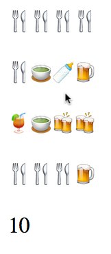

    ,--.   ,--.,--.   ,--.,------.,--.   ,--.
    |   `.'   ||   `.'   ||  .--. '\  `.'  /
    |  |'.'|  ||  |'.'|  ||  '--'.' '.    /
    |  |   |  ||  |   |  ||  |\  \    |  |
    `--'   `--'`--'   `--'`--' '--'   `--'

*"MMRY" - The classic memory game in a tweet of JS. (280 bytes)
By [KesieV](http://www.kesiev.com) (c) 2018*

Keep flipping two cards in a 4x4 grid and find all the pairs in the least
number of attempts. The wrong ones will be covered again at the beginning of
the next turn so try to remember its cards position.

This version of the game has nice drinks as card pictures and offers a turn
counter, so you can keep track of your performances.

---

**One More Thing:**

Play this game [here](http://www.kesiev.com/mmry/mmry.html).